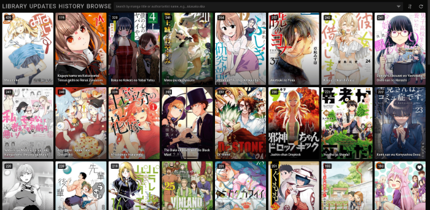

> [!CAUTION]
> The upstream repository doesn't exist anymore. This app can't be installed anymore and this package is archived.

<!--
N.B.: This README was automatically generated by https://github.com/YunoHost/apps/tree/master/tools/readme_generator
It shall NOT be edited by hand.
-->

# Nonbiri for YunoHost

[](https://dash.yunohost.org/appci/app/nonbiri)  

[](https://install-app.yunohost.org/?app=nonbiri)

*[Lire ce readme en français.](./README_fr.md)*

> *This package allows you to install Nonbiri quickly and simply on a YunoHost server.
If you don't have YunoHost, please consult [the guide](https://yunohost.org/#/install) to learn how to install it.*

## Overview

Nonbiri is a self-hosted back-end and front-end for MangaDex.

### Features

- Online/offline read and browse MangaDex
- History tracker and scheduled updates
- Chapters and covers are automatically downloaded/cached forever
- Real-time synchronization between tabs/browsers and computers
- Long strip, right-to-left and left-to-right reading modes
- Customizable keyboard shortcuts for navigating between pages and chapters

**Shipped version:** 0.1.8~ynh1

## Screenshots



## Documentation and resources

- Upstream app code repository: <https://github.com/rs1703/nonbiri>
- YunoHost Store: <https://apps.yunohost.org/app/nonbiri>
- Report a bug: <https://github.com/YunoHost-Apps/nonbiri_ynh/issues>

## Developer info

Please send your pull request to the [testing branch](https://github.com/YunoHost-Apps/nonbiri_ynh/tree/testing).

To try the testing branch, please proceed like that.

```bash
sudo yunohost app install https://github.com/YunoHost-Apps/nonbiri_ynh/tree/testing --debug
or
sudo yunohost app upgrade nonbiri -u https://github.com/YunoHost-Apps/nonbiri_ynh/tree/testing --debug
```

**More info regarding app packaging:** <https://yunohost.org/packaging_apps>
